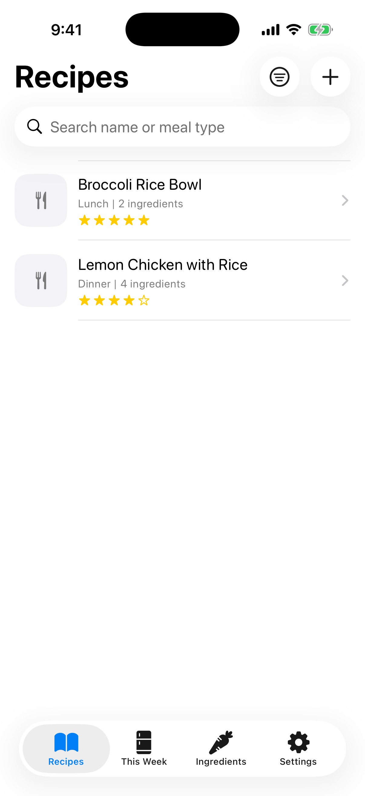
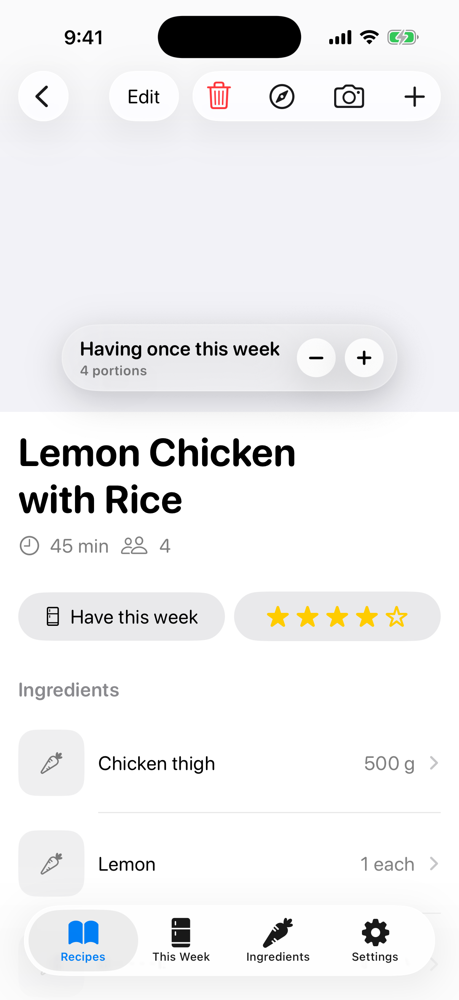
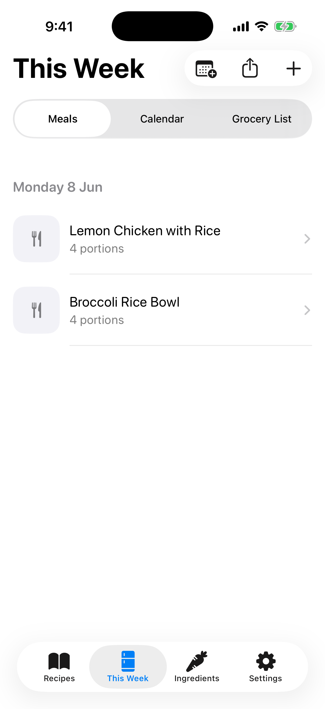
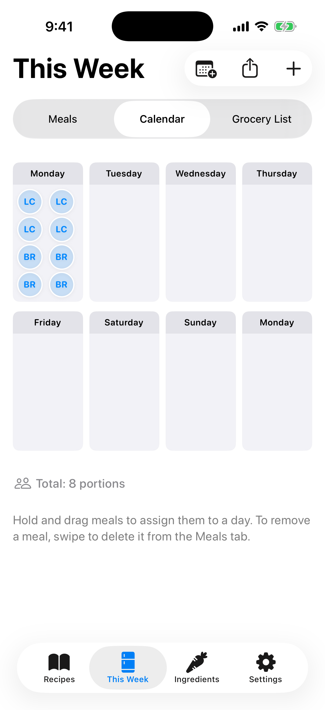
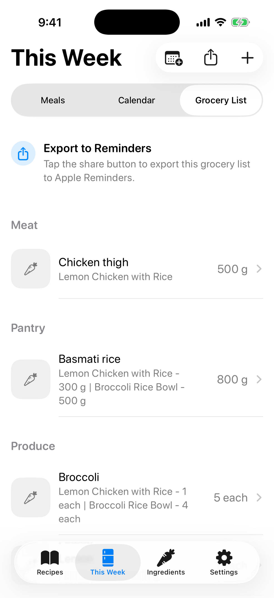
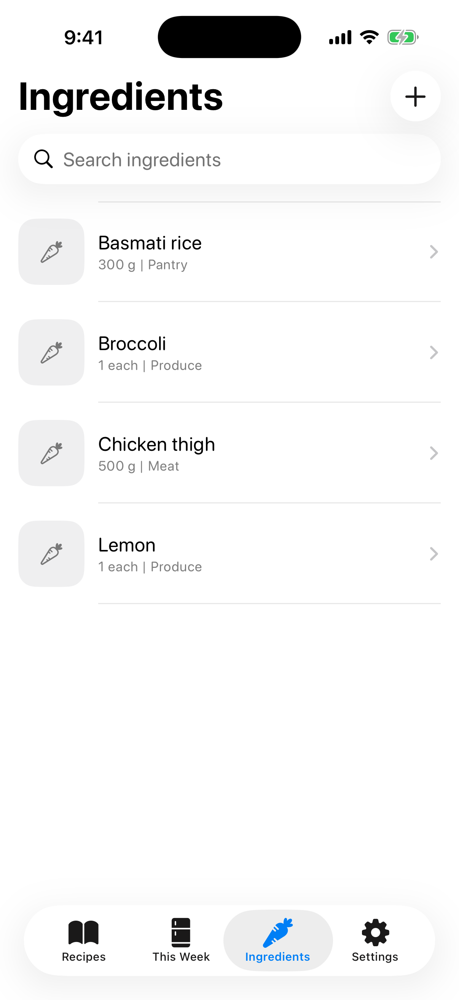
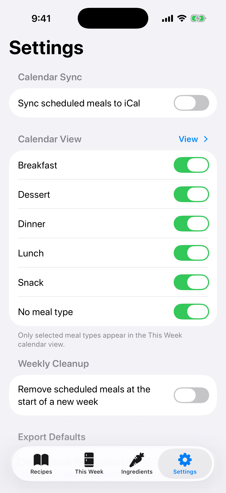

# Food Basket

Food Basket is an iOS meal-planning app for managing recipes, planning dinners for the current week, exporting a generated shopping list to Reminders, and adding meal plans to Calendar.

## Screenshots

These screenshots use the app's preview dataset so placeholder recipes, ingredients, and weekly planning content are visible.

| Recipes | Recipe Detail | This Week |
| --- | --- | --- |
|  |  |  |

| Calendar | Grocery List | Ingredients |
| --- | --- | --- |
|  |  |  |

| Settings |
| --- |
|  |

## Features

- Create, edit, search, and delete recipes.
- Record a recipe's method, cooking time in minutes, serving count, ingredients, and meal photo.
- Create, edit, search, and delete ingredients with categories and generated images.
- Add recipes to the current week's meal plan and open their recipe details directly from the weekly view.
- Generate a categorized shopping list from the current meal plan.
- Export shopping-list items to a selected Reminders list and remove items previously added by Food Basket.
- Export meal-plan days to a selected Calendar as all-day events with recipe deep links.
- Use Siri shortcuts to read the current dinner plan or add groceries to the remembered Reminders list.

## Project Structure

The Xcode project uses a filesystem-synchronized root group, so the folders on disk are reflected directly in Xcode.

```text
FoodBasket/FoodBasket/
|-- App/                 App entry point and root tab view
|-- Data/                SwiftData container, models, seed data, and previews
|-- Features/
|   |-- Ingredients/     Ingredient list, detail, form, imagery, and image generation
|   |-- Calendars/       Calendar export service, picker, and supporting models
|   |-- Recipes/         Recipe list, detail, form, ingredient selection, and photos
|   |-- Reminders/       Reminders export service, picker, and supporting models
|   |-- Siri/            App intents, shortcuts, and snippet views
|   `-- WeekPlan/        Weekly meal plan, shopping list, and add-meal flow
|-- Resources/           Asset catalogs
`-- Shared/              Reusable UI components and extensions
```

`AppIcon.icon` remains at `FoodBasket/FoodBasket/AppIcon.icon` because Icon Composer expects the bundle at the synchronized project root.

## Requirements

- Xcode 26.5 or later
- iOS 26.5 or later
- A physical device for camera capture and device-specific integrations

Food Basket requests camera access when taking meal photos, Calendar access when exporting meal-plan events, and Reminders access when exporting shopping-list items. Ingredient image generation uses Apple's Image Playground framework when available.

## iCloud Sync

Food Basket syncs SwiftData records across devices signed into the same iCloud account using the private CloudKit container `iCloud.com.logan.FoodBasket`.

To initialize or update the development CloudKit schema, add the launch argument `-InitializeCloudKitSchema YES` to the Debug scheme and run the app once. Remove the argument for normal development launches. Promote the schema in CloudKit Console before releasing the app.

## Build

Open `FoodBasket/FoodBasket.xcodeproj` in Xcode, or run:

```sh
xcodebuild -project FoodBasket/FoodBasket.xcodeproj \
  -scheme "Food Basket" \
  -configuration Debug \
  -destination 'generic/platform=iOS' \
  CODE_SIGNING_ALLOWED=NO \
  build
```
